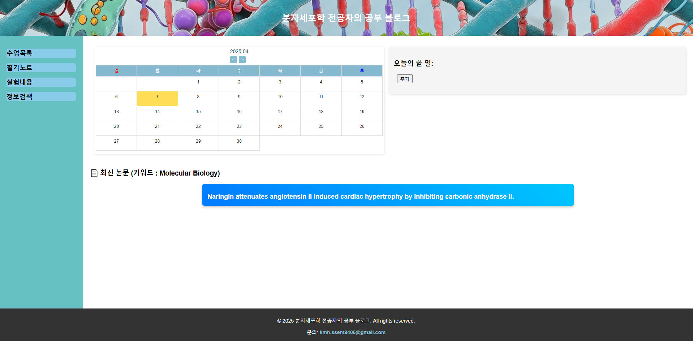

# 🧬 CellBlogAPI: 분자세포학 전공자의 공부 블로그 (API 확장 버전)

> 📢 **Note for international users:**  
> English explanation is available below in this README.

---

## 🖥️ 제작 동기 및 소개

[이전 프로젝트](https://www.notion.so/Project-2-HTML-CSS-1ac4ffa3e1d780f28b2cc4d4c3ff6f99?pvs=21)에서 제작했던 **’분자세포학 전공자의 공부 블로그’**를 기반으로, API 기능들을 확장하여 전공과 밀접한 두 가지 요소를 추가했습니다:

1. **PubMed API**를 통해 최신 전공 논문 자동 수집
2. **RCSB PDB API**를 통해 단백질 정보 및 3D 구조 검색 기능 구현

전공 특성상 자주 접하게 되는 **논문 정보와 단백질 구조** 데이터를 직접 불러와 보여주는 블로그로 확장하였습니다.

---

## 🔗 관련 링크

- 🔗 Website: [CellBlogAPI](https://kmh8405.github.io/CellBlogAPI/)
- 🧾 Presentation: [Notion](https://www.notion.so/Project-3-Web-API-jQuery-Project-2-API-1ce4ffa3e1d780da8108e8f6b1567c60?pvs=21)

---

## 🗓️ 제작 기간

- **2025.04.03 ~ 2025.04.08 (총 6일)**

---

## 🧑 제작 인원

- 개인 프로젝트 (1인 개발)

---

## 🛠️ 추가된 JavaScript 기능

- 📅 달력
    - 한국 시간 기준 자정에 날짜 자동 갱신
    - 오늘 날짜 `.today` 클래스로 강조 표시
    - 월 단위 이동 버튼 구현
- 📝 메모장
    - 메모 항목 추가 / 삭제 가능
    - **쿠키 기반** 당일 메모 저장 (자정 이후 자동 초기화)

---

## 🎯 주요 기능 (API 기반)

- 📰 **최신 논문 불러오기**
    - **PubMed API** 사용
    - "Molecular Biology" 관련 최신 논문 5개 자동 불러오기
    - 제목에 마우스 오버 시 **초록(abstract)** 표시
    - jQuery를 활용한 **광고 문구 스타일 애니메이션**
- 🔍 **단백질 정보 및 3D 구조**
    - **RCSB PDB API** 사용
    - 분자량, 길이, DOI 등 주요 정보 출력
    - iframe을 통한 **3D 구조 시각화**

---

## 💻 사용 기술 스택

- **HTML**
- **CSS**
- **JavaScript**
    - Vanilla JS
    - jQuery (AJAX 활용)

---

## 📦 사용한 API

- 🔬 [PubMed E-utilities API](https://www.ncbi.nlm.nih.gov/books/NBK25501/)
    - `esearch`, `efetch` 엔드포인트 사용
- 🧪 [RCSB Protein Data Bank (PDB) API](https://data.rcsb.org/)
    - 단백질 메타데이터 및 구조 뷰어 연동

---

## 📷 캡쳐 화면(일부)

> 본 프로젝트는 분자세포생물학 전공자의 전공 기록 및 정보 공유를 목적으로 합니다.
> 

   
---

# 🧬 CellBlogAPI: A Study Blog by a Molecular & Cell Biology Major (API Extended Version)

⚠️ *Note: The website itself is only available in Korean. This README provides English explanations for international viewers.*

## 🖥️ Background & Introduction

Based on the [previous project](https://www.notion.so/Project-2-HTML-CSS-1ac4ffa3e1d780f28b2cc4d4c3ff6f99?pvs=21) titled **"A Study Blog by a Molecular & Cell Biology Major"**, this version adds two API-powered features highly relevant to the field:

1. Auto-fetching of the latest academic papers using the **PubMed API**
2. Searchable protein data and 3D visualization using the **RCSB PDB API**

The result is an expanded blog that automatically brings in **scientific literature and protein structure data**, both commonly encountered in this major.

---

## 🔗 Links

- 🔗 Website: [CellBlogAPI](https://kmh8405.github.io/CellBlogAPI/)
- 🧾 Presentation: [Notion](https://www.notion.so/Project-3-Web-API-jQuery-Project-2-API-1ce4ffa3e1d780da8108e8f6b1567c60?pvs=21)

---

## 🗓️ Development Period

- **April 3 – April 8, 2025 (6 days total)**

---

## 🧑 Team

- Solo project (1 developer)

---

## 🛠️ JavaScript Features

- 📅 Calendar
    - Automatically updates to current date (KST-based midnight refresh)
    - `.today` class highlights the current day
    - Buttons for navigating between months
- 📝 Memo Pad
    - Add and delete memo items
    - Stores memos **for the current day only** via cookies
    - Auto-clears at midnight

---

## 🎯 Key Features (API-based)

- 📰 **Fetch Latest Papers**
    - Uses **PubMed API**
    - Automatically loads 5 recent papers on "Molecular Biology"
    - Abstract appears on mouse hover
    - jQuery-based animation styled like a promotional banner
- 🔍 **Protein Info + 3D Structure**
    - Uses **RCSB PDB API**
    - Displays molecular weight, length, DOI, etc.
    - Visualizes structure using an embedded `iframe`

---

## 💻 Tech Stack

- **HTML**
- **CSS**
- **JavaScript**
    - Vanilla JS
    - jQuery (AJAX-based)

---

## 📦 APIs Used

- 🔬 [PubMed E-utilities API](https://www.ncbi.nlm.nih.gov/books/NBK25501/)
    - Endpoints used: `esearch`, `efetch`
- 🧪 [RCSB Protein Data Bank (PDB) API](https://data.rcsb.org/)
    - Integrated metadata and 3D viewer

---

## 📷 Screenshots (Partial)

> This project is designed as a record and resource sharing platform for students majoring in Molecular & Cell Biology.
>